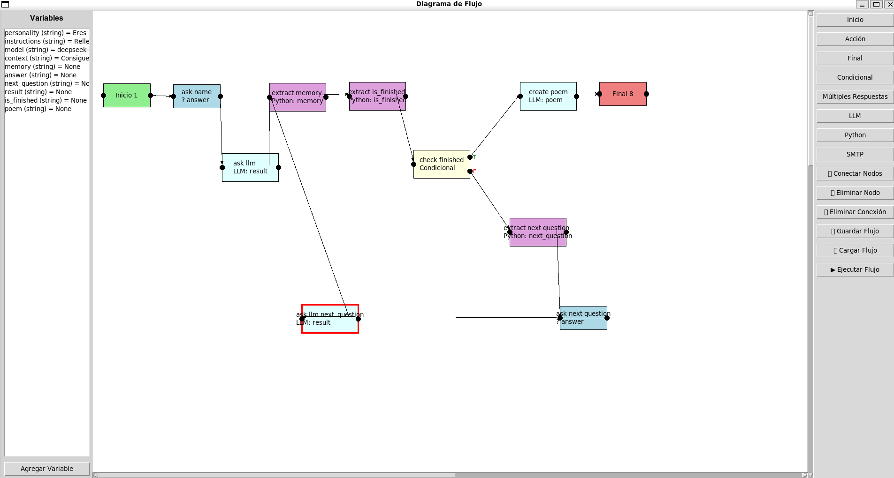

# Flow Diagram App

Esta aplicación es una herramienta visual para diseñar, configurar y ejecutar flujos de trabajo compuestos por distintos tipos de nodos. Cada nodo representa una acción o condición, y se pueden conectar entre sí para definir el flujo de ejecución.

La aplicación está desarrollada en Python utilizando Tkinter para la interfaz gráfica y sigue los principios SOLID. Cada tipo de nodo tiene su propia clase con métodos para configurar y ejecutar su funcionalidad.




## Características

### Nodos existentes:
- **Inicio**: Marca el inicio del flujo.
- **Acción**: Permite realizar una acción que puede ser:
  - *Imprimir*: Muestra un mensaje en la consola.
  - *Pregunta*: Solicita al usuario una respuesta y la almacena en una variable.
- **Condicional**: Evalúa condiciones (usando operadores como `==`, `!=`, `>`, `<`) y dirige el flujo según el resultado.
- **Múltiples Respuestas**: Muestra una pregunta con varias opciones y almacena la respuesta elegida.
- **LLM**: Envía un prompt a un modelo de lenguaje (por ejemplo, usando la librería _ollama_) y almacena la respuesta.
- **Python**: Permite ejecutar código Python personalizado (se espera que definas una función `func` en el código) y almacena el resultado.
- **SMTP**: Envía un correo electrónico utilizando el protocolo SMTP con los datos de configuración proporcionados.

### Extensibilidad
Cada nodo se implementa como una clase que extiende la clase abstracta `FlowNode`. Para agregar nuevos nodos, basta con crear una nueva clase que implemente los métodos `configure(parent, variable_manager)` y `execute(context)` y agregar su creación en la factoría (`NodeFactory`).

### Interfaz gráfica
La aplicación muestra un canvas en el que se pueden agregar, arrastrar y conectar nodos. La barra de herramientas permite agregar nuevos nodos y gestionar conexiones.

## Instalación

### Requisitos:
- Python 3.8 o superior.
- Las siguientes librerías (algunas vienen incluidas en la distribución estándar):
  - Tkinter (normalmente incluida con Python en sistemas de escritorio)
  - `networkx`
    ```bash
    pip install networkx
    ```
  - (Opcional) La librería oficial de [Ollama](https://github.com/ollama/ollama) si se desea usar el nodo LLM.
    ```bash
    pip install ollama
    ```

### Pasos de instalación:
1. Clonar el repositorio (o copiar el código fuente) en tu máquina:
   ```bash
   git clone https://github.com/tu_usuario/flow-diagram-app.git
   cd flow-diagram-app
   ```

## Uso del Proyecto

### Ejecutar la aplicación
Desde la raíz del proyecto, ejecuta:
```bash
python main.py
```
Se abrirá la ventana principal con un canvas, un panel lateral para variables y una barra de herramientas.

### Cómo agregar y conectar nodos

#### Agregar nodos:
- Usa los botones de la barra de herramientas para agregar los distintos tipos de nodos.
- Por ejemplo, haz clic en "Inicio" para agregar el nodo de inicio o "SMTP" para agregar el nodo que envía correos.

#### Configurar nodos:
- Haz doble clic sobre un nodo para abrir su ventana de configuración.
- Cada nodo tiene campos específicos según su funcionalidad.

**Ejemplo:**
- En el nodo Acción, puedes seleccionar entre "imprimir" o "pregunta".
- En el nodo Condicional, defines condiciones (variable, operador, valor) y el operador lógico (AND/OR).
- En el nodo SMTP, se te solicitarán datos como servidor SMTP, puerto, usuario, contraseña, remitente, destinatario, asunto y cuerpo del mensaje.

**Importante:** Si al abrir la ventana de configuración aparece el error grab failed: window not viewable, asegúrate de que el método update_idletasks() se llame antes de grab_set() en el Toplevel (ya se ha aplicado en la versión actual).

#### Conectar nodos:
- Los nodos se conectan haciendo clic en el punto de salida (ícono de conexión) de un nodo y luego haciendo clic en el punto de entrada del nodo destino.
- Para los nodos condicionales, existen dos salidas: "True" y "False".

## Tutorial de cada nodo

### Nodo Inicio
- **Función:** Marca el comienzo del flujo.
- **Uso:** Solo debe existir un nodo de inicio.
- Al ejecutarse, simplemente transfiere la ejecución al siguiente nodo conectado.

### Nodo Acción
- **Función:** Permite imprimir un mensaje en la consola o hacer una pregunta.
- **Configuración:**
  - Si eliges Imprimir, se te pedirá que ingreses el texto a imprimir.
  - Si eliges Pregunta, se te pedirá la pregunta y el nombre de la variable donde se almacenará la respuesta.
- **Ejemplo:**
  - Para imprimir: "Acción: Mostrar mensaje 'Hola mundo'"
  - Para preguntar: "¿Cuál es tu edad?" y almacenar la respuesta en la variable edad.

### Nodo Condicional
- **Función:** Evalúa una o varias condiciones sobre las variables y dirige el flujo.
- **Configuración:**
  - Define una o más condiciones (por ejemplo, variable edad, operador >, valor 18) y selecciona el operador lógico (AND/OR).
  - El flujo se bifurca en función del resultado:
    - Si se cumple la condición, la ejecución se dirige a la salida "True".
    - En caso contrario, a la salida "False".

### Nodo Múltiples Respuestas
- **Función:** Presenta al usuario una pregunta con opciones y almacena la respuesta seleccionada.
- **Configuración:**
  - Ingresa la pregunta, las opciones (separadas por comas) y el nombre de la variable para almacenar la respuesta.

### Nodo LLM
- **Función:** Envía un prompt a un modelo de lenguaje (LLM) y almacena la respuesta.
- **Configuración:**
  - Proporciona el modelo, personalidad, instrucciones, contexto y prompt.
  - La respuesta se almacena en una variable.

### Nodo Python
- **Función:** Ejecuta un bloque de código Python definido por el usuario.
- **Configuración:**
  - Ingresa el código (debe definir una función llamada func), los parámetros (coma-separados) y el nombre de la variable donde se almacenará el resultado.

### Nodo SMTP
- **Función:** Envía un correo electrónico utilizando el protocolo SMTP.
- **Configuración:**
  - Ingresa los siguientes datos:
    - Título: Nombre descriptivo del nodo.
    - Servidor SMTP y Puerto SMTP.
    - Usuario y Contraseña.
    - Remitente y Destinatario (para el destinatario, se pueden separar múltiples correos con comas).
    - Asunto.
    - Cuerpo del correo: Puede contener texto plano o HTML (configurable mediante un checkbox).
- **Ejemplo:**
  - Puedes configurar un nodo SMTP para enviar un correo con un mensaje de bienvenida.

## Cómo crear nuevos nodos en el código

Para agregar un nuevo tipo de nodo:

1. Crea una nueva clase (por ejemplo, NuevoNodo) en un archivo dentro de la carpeta models/. Esta clase debe extender FlowNode (definido en models/nodes.py).

2. Implementa los métodos:
   - `configure(self, parent, variable_manager)`: Para lanzar la ventana de configuración.
   - `execute(self, context)`: Para ejecutar la acción del nodo y retornar el siguiente nodo a ejecutar.

3. Agrega la nueva clase en la factoría (models/node_factory.py) para que, cuando se invoque NodeFactory.create_node("nuevonodo", x, y), se instancie la clase correspondiente.

## Ejemplo de ejecución de proyecto: "Saludo Personalizado"

Para ilustrar el uso de la aplicación, a continuación se muestra un ejemplo de JSON para un flujo que solicita el nombre del usuario y luego imprime en la consola un saludo.

### Ejemplo JSON
```json
{
  "nodes": [
    {
      "id": "node-1",
      "x": 100,
      "y": 100,
      "node_type": "inicio",
      "text": "Inicio",
      "title": "Inicio",
      "config": {},
      "connected_to": "node-2",
      "true_connection": null,
      "false_connection": null
    },
    {
      "id": "node-2",
      "x": 300,
      "y": 100,
      "node_type": "accion",
      "text": "Acción",
      "title": "Pregunta Nombre",
      "config": {
        "action_type": "pregunta",
        "question": "Ingrese su nombre:",
        "variable_name": "nombre"
      },
      "connected_to": "node-3",
      "true_connection": null,
      "false_connection": null
    },
    {
      "id": "node-3",
      "x": 500,
      "y": 100,
      "node_type": "accion",
      "text": "Acción",
      "title": "Saludo",
      "config": {
        "action_type": "imprimir",
        "print_text": "hola ${nombre}!!"
      },
      "connected_to": null,
      "true_connection": null,
      "false_connection": null
    }
  ],
  "variables": []
}
```

### Cómo usar este ejemplo

1. **Guardar el JSON:** Copia el contenido anterior en un archivo (por ejemplo, saludo.json).

2. **Ejecutar la aplicación:**
   - Inicia la aplicación con `python main.py`.

3. **Cargar el flujo:**
   - Usa el botón "Cargar Flujo" y selecciona el archivo saludo.json.

4. **Ejecutar el flujo:**
   - Haz clic en "▶ Ejecutar Flujo".
   - Se abrirá un diálogo pidiéndote el nombre. Ingresa, por ejemplo, "Julian" y presiona OK.
   - La consola mostrará:
     ```
     hola Julian!!
     ```

## Conclusión

Esta aplicación permite diseñar y ejecutar flujos de trabajo de forma visual. Gracias a la arquitectura basada en SOLID, es fácil extender la funcionalidad del sistema agregando nuevos tipos de nodos sin modificar el controlador o la interfaz.

¡Disfruta creando tus flujos!